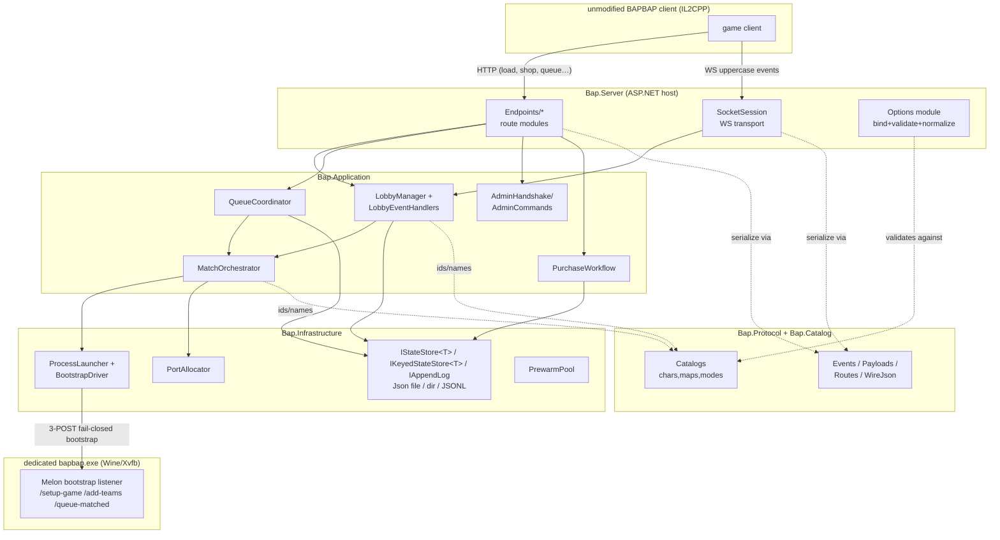
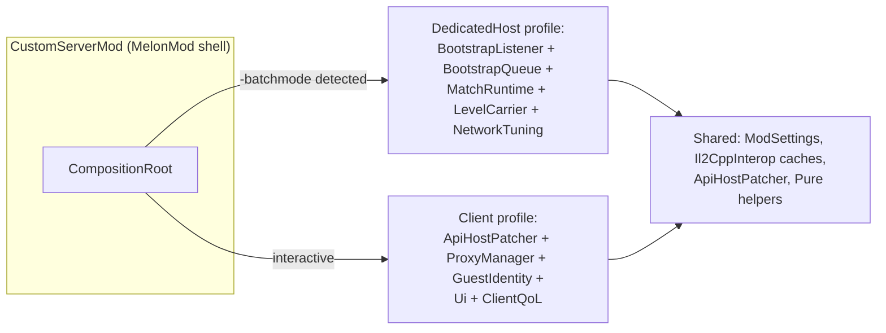

# 02 — Target Architecture

Destination design for both halves of the stack. The migration route to get here without breaking
the client is `04-migration-plan.md`; this doc describes the end state.

## Part A — Server

### A.1 Solution layout

```text
BapCustomServer.sln
├── src/
│   ├── Bap.Protocol/                  # THE wire contract. No dependencies.
│   │   ├── Events.cs                  # from Contracts.cs Events (uppercase strings)
│   │   ├── EventNormalization.cs      # from LobbyService.NormalizeEvent (alias tolerance)
│   │   ├── Envelopes.cs               # SocketEnvelope / OutgoingEnvelope
│   │   ├── Payloads/                  # JoinLobbyPayload, QueueMatchedPayload, GameStartedPayload,
│   │   │                              #   MatchmakingGameData/TeamData/QueueMatchedData, LoadResponse…
│   │   ├── Routes.cs                  # route alias sets as data (LoadAliases[], SocketDiscoveryPaths[]…)
│   │   ├── WireJson.cs                # JsonContract.Options + source-generated JsonSerializerContext
│   │   └── ErrorCodes.cs              # ERR_BANNED, ERR_NOT_LEADER, ERR_NOTREADY, ERR_SERVER_FULL…
│   │
│   ├── Bap.Catalog/                   # single source of truth for chars/maps/modes/skins
│   │   ├── characters.json / maps.json / gamemodes.json   (embedded resources — see A.6)
│   │   ├── CharacterCatalog.cs  MapCatalog.cs  GameModeCatalog.cs
│   │   └── ForbiddenSkinAssetIds.cs   # 300001/300004/300006 deny-list (HC7)
│   │
│   ├── Bap.Options/                   # option types ONLY (CustomServerOptions + nested option
│   │   │                              #   classes). A low leaf like Protocol/Catalog: referenced by
│   │   │                              #   Application, Infrastructure AND Server without violating
│   │   │                              #   the dependency direction (see A.7). Binding/validation
│   │   │                              #   code does NOT live here — only the types.
│   │
│   ├── Bap.Domain/                    # pure domain model, no ASP.NET/IO
│   │   ├── Lobbies/    (Lobby, LobbyPlayer, LobbyStateMachine, LeaderRules)
│   │   ├── Matches/    (MatchDescriptor, PortQuad, BootstrapState enum/state machine)
│   │   ├── Queue/      (QueueEntry, QueueTimerState)
│   │   └── Players/    (PlayerProfile, Balances, Loadout)
│   │   # RECOMMENDATION (not mandate): consider merging Bap.Domain INTO Bap.Application as a
│   │   # Domain/ folder. The "domain" here is one lobby state machine, a port quad, and queue
│   │   # math — a full project may be over-engineering for its size. Keep the no-ASP.NET/no-IO
│   │   # rule either way (enforceable per-namespace by the architecture test). Decide at Phase 4.
│   │
│   ├── Bap.Application/               # orchestration; depends on Domain+Protocol+Catalog+Options
│   │   ├── Lobbies/    LobbyManager, LobbyEventHandlers (one class per WS event)
│   │   ├── Matches/    MatchOrchestrator (the shared StartCustom/StartMatchmaking tail),
│   │   │               MatchLifecycleTracker (empty-lobby grace, cleanup)
│   │   ├── Queue/      QueueCoordinator
│   │   ├── Admin/      AdminHandshake (MOD_HELLO/MOD_AUTH/ADMIN_AUTH), AdminCommands
│   │   ├── Economy/    PurchaseWorkflow (the logic now inline in /api/chars/listing/purchase)
│   │   └── Abstractions/  IGameServerLauncher, IPortAllocator, IClock,
│   │                      IStateStore<T> / IKeyedStateStore<T> / IAppendLog (see A.5)
│   │
│   ├── Bap.Infrastructure/            # implementations of Application abstractions
│   │   ├── Processes/  GameServerProcessManager (split: ProcessLauncher, BootstrapDriver,
│   │   │               ReadinessProbes, StallDetector), PrewarmPool
│   │   ├── Ports/      PortAllocator (existing class, behind IPortAllocator)
│   │   ├── Persistence/
│   │   │   ├── JsonFileStore<T>        # snapshot stores (single file, tmp-write + File.Move)
│   │   │   ├── JsonDirectoryStore<T>   # IKeyedStateStore<T> for players/{id}/player.json + index
│   │   │   └── JsonlAppendLog          # IAppendLog for match history / audit log
│   │   └── Diagnostics/ DiagnosticsLogBuffer, ResourceMonitor
│   │
│   ├── Bap.Server/                    # thin ASP.NET host (target: < 300 lines Program.cs)
│   │   ├── Program.cs                 # builder + AddBapServer() + MapBapEndpoints()
│   │   ├── Endpoints/                 # one static class per domain, driven by Bap.Protocol.Routes
│   │   │   ├── AuthEndpoints.cs           # /api/load + 15 aliases → BuildLoadResult
│   │   │   ├── SocketDiscoveryEndpoints.cs
│   │   │   ├── WebSocketEndpoint.cs       # /ws upgrade → SocketSession
│   │   │   ├── MetagameStubEndpoints.cs   # HC4: iap/challenge/code/creator stubs, explicitly named
│   │   │   ├── ShopEndpoints.cs  FriendsEndpoints.cs  QueueEndpoints.cs
│   │   │   ├── MatchCallbackEndpoints.cs  # /game-ping /game-ended /team-ended (+ /api/internal/*)
│   │   │   ├── AdminEndpoints.cs          # + rate limiter policy
│   │   │   └── DiagnosticsEndpoints.cs
│   │   ├── Sockets/    SocketSession (framing, ArrayPool, close semantics, per-send lock — see A.3)
│   │   └── Options/    binding + validation + CSV/JSON normalization for the Bap.Options types
│   │                   (from Program.cs PostConfigure blocks) as IConfigureOptions/IValidateOptions
│   │                   classes — binding stays in the host; the TYPES live in Bap.Options
│   │
│   └── (unchanged) CustomClientProxy/
│
└── tests/
    ├── Bap.Protocol.Tests/            # golden wire tests (03-protocol-compatibility.md)
    ├── Bap.Domain.Tests/  Bap.Application.Tests/  Bap.Infrastructure.Tests/
    ├── Bap.Server.ContractTests/      # WebApplicationFactory route/shape snapshots
    └── BapCustomServer.Tests/         # existing 375 tests, kept green throughout migration
```

### A.2 Component diagram



Dependency direction (enforced with project references + an architecture test):
`Server → Application → Domain`, `Server/Application → Protocol/Catalog/Options`,
`Server → Infrastructure → Application.Abstractions + Options`. `Protocol`, `Catalog`, and
`Options` depend on nothing.

Why `Bap.Options` is its own leaf: `CustomServerOptions` (and its nested option classes) are
consumed by `Bap.Infrastructure` — `BootstrapDriver`/`StallDetector` read the bootstrap timeout
and stall-window knobs directly. If the option types lived in `Bap.Server`, Infrastructure would
need a reference *up* to the host, violating `Server → Infrastructure` and failing the
NetArchTest rule in `05-testing-and-tooling.md` §2. Types go in the leaf; binding/validation
(`IConfigureOptions`/`IValidateOptions`, CSV/JSON normalization) stays in `Bap.Server/Options/`.
(Placing the types in `Bap.Application/Abstractions` is an acceptable alternative; a dedicated
project keeps the architecture test simplest.)

**Host-project naming (explicit, because two external consumers bind to it):**
`CustomMatchServer/BapCustomServer.csproj` keeps its name and path through Phase 7, with
`Bap.Server`'s contents growing inside/alongside it rather than replacing it wholesale. Reasons:
(1) the AMP publish flow (`tools/Build-Amp*.ps1`, GitHub AutoInstall template) publishes that
project by path; (2) the test suite locates the host via
`WebApplicationFactory<ApiEntryPoint>` — `ApiEntryPoint` is a marker class at the bottom of
`Program.cs` (`Program.cs:2770–2776`) added precisely because the top-level `Program` collides
with `CustomClientProxy`'s. If/when the host project is ever renamed (post-Phase 7 at the
earliest), the marker type, the AMP scripts, and the publish pipeline move in one PR.

### A.3 Splitting `LobbyService` (the heart transplant)

Current 3,512-line class becomes four collaborators:

1. **`SocketSession`** (Server layer): owns one WebSocket — receive loop, fragmented-message cap
   (4 MB), ArrayPool buffers, close semantics, and the per-connection send path. During the
   migration this is a **mechanical extraction of the existing lock-per-send model** — the
   per-connection `SemaphoreSlim SendLock` with its 10 s timeout followed by `Socket.Abort()`
   (`LobbyService.cs:3329–3368`) moves as-is. Do NOT replace it with a channel-based send queue
   in Phase 4: (a) that contradicts R2/decision-log #3 in `06-risks-and-open-questions.md`
   ("keep coarse single-gate locking during migration; perf work post-Phase 7"); (b) the
   abort-on-stall semantic is load-bearing (one wedged peer must not block the global `_gate`);
   (c) the `GAME_STARTED` multicast relies on SYNCHRONOUS per-target exception isolation
   (`LobbyService.cs:1943–1978`) — a queue makes send failures asynchronous and silently changes
   which sends are known-failed at dispatch time; (d) close racing a concurrent send is currently
   handled by closing *under* the send lock (`CloseSocketUnderLockAsync`) — a queue changes that
   race too. If the send queue is still wanted post-Phase-7, its exit criteria are: abort-on-stall
   preserved (wedged peer aborted within the same 10 s bound), close-race behavior preserved, and
   a 50-socket broadcast test asserting dead-socket cleanup (no leaked `_clients` entries, no
   aborted dispatch to healthy sockets).
2. **`LobbyEventDispatcher`** (Application): the `HandleMessageAsync` switch, expressed as a
   registry `Dictionary<string, IWsEventHandler>` keyed by normalized event name. The default-case
   diagnostic logging for unknown events (used to discover IL2CPP-stripped friends event strings)
   is preserved verbatim.
3. **`LobbyManager`** (Application): lobby CRUD, leader rules, ready/team/settings mutations,
   over an explicit `LobbyStateMachine` in Domain (`Idle → Starting → Matched → InGame → Cleanup`)
   so the atomic-claim races patched at `LobbyService.cs:1778`/`1831` become impossible states
   rather than guarded code.
4. **`MatchOrchestrator`** (Application): single implementation of the start tail used by BOTH
   paths — reserve ports → launch → bootstrap → build `QueueMatchedPayload` → multicast
   `QUEUE_MATCHED` then `GAME_STARTED` (one multicast routine with per-target error isolation,
   deduplicating the two near-copies at lines ~1945 and ~2217) → register with
   `MatchLifecycleTracker`.

Admin handshake (`MOD_HELLO`/`MOD_AUTH`/`ADMIN_AUTH`) moves to `AdminHandshake` registered as three
event handlers; nonce store and grant cache become injected components with an `IClock` for testing.

### A.4 Splitting `GameServerProcessManager`

Keep the hard-won behavior, model it explicitly:

- **`ProcessLauncher`** — launcher templating (`{gameExecutable}`, `{logFile}`, port placeholders),
  spawn, kill, exit monitoring. Windows-direct and Wine-wrapper (`start-match.sh`) are the same code
  path (they already are — templating covers it); keep it that way.
- **`BootstrapDriver`** — an explicit state machine:
  `AwaitingListener → SetupPosted → SetupApplied → TeamsPosted → TeamsApplied → QueuePosted → Ready | Failed(reason)`
  with the F033 listener-only detection and setup-POST replay as named transitions. Every existing
  timeout knob maps to exactly one transition guard, which finally makes
  `GameServerManagedBootstrapStatusTimeoutSeconds` vs `…ListenerOnlyTimeoutSeconds` vs
  `…HttpTimeoutSeconds` explicable in one diagram.
- **`ReadinessProbes`** — TCP/UDP/KCP port polling helpers (pure, already partially tested by
  `UdpPortDetectionTests`).
- **`StallDetector`** — wrapper-only vs normal stall windows.
- **`PrewarmPool`** — from `GameServerPrewarmService`; hands a ready session to `BootstrapDriver`.

Fail-closed semantics are unchanged, with the path-specific behavior preserved exactly: on
`Failed(reason)` the **matchmaking** path requeues players (HC2), while the **custom-lobby** path
sends `START_CUSTOM_GAME_FAIL`/`ERR_GAME_SERVER_BOOTSTRAP` and players stay in the lobby
(`LobbyService.cs:1863–1875`) — see `03-protocol-compatibility.md` §1.5. `BootstrapDriver` must
also preserve the `LaunchGameServers=false` external-host short-circuit
(`GameServerProcessManager.cs:39–52`): no spawn, no bootstrap, session built from
`ExternalGameServerOptions` — the integration test suite runs entirely through this branch.

### A.5 Persistence: three seams, not one

The current persistence is NOT one shape, so one interface can't cover it honestly. Three
abstractions, each matching an existing on-disk layout exactly:

```csharp
// 1. Snapshot stores — the SIX services that tmp-write + File.Move ONE file:
//    EconomyService, ShopService, RankedService, FriendsService, ServerAdminService (state file),
//    PlayerOverridesService.
public interface IStateStore<TState> where TState : class, new()
{
    TState Read();                                    // point-in-time snapshot
    void Mutate(Action<TState> mutate);               // atomic read-modify-write, persisted
    TResult Mutate<TResult>(Func<TState, TResult> f); // mutations that RETURN results — e.g.
                                                      // PurchaseCharacter → CharacterPurchaseResult;
                                                      // without this every purchase-style API
                                                      // needs a second racy Read()
}

// 2. Keyed store — PlayerStorageService is a DIRECTORY of per-player files plus an index
//    (players/{accountId}/player.json + index.json — PlayerStorageService.cs:713–730, 732+):
public interface IKeyedStateStore<TState> where TState : class, new()
{
    TState? Read(string key);
    void Mutate(string key, Action<TState> mutate);
    IReadOnlyCollection<string> Keys();               // backed by index.json
}

// 3. Append log — MatchHistoryService (JSONL) and the admin audit log:
public interface IAppendLog
{
    void Append(string jsonLine);
    IEnumerable<string> ReadTail(int count);
}
```

- `JsonFileStore<T>` / `JsonDirectoryStore<T>` / `JsonlAppendLog` (defaults): same file names and
  layouts as today (`economy-state.json`, `players/{id}/player.json`, `match-history.jsonl`, …) so
  an upgraded server reads existing data untouched. Single writer per file, atomic rename-on-write
  for snapshots — replacing eight bespoke load/save/lock blocks with three implementations.
- **`SqliteStore<T>` is dropped from Phase 3** (was: optional provider). It is premature: the AMP
  host's operational backup/restore works on `data/` files today, and no requirement exists that
  JSON can't meet. The `IStateStore<T>` seam is the deliverable; a SQLite implementation can be
  added behind it later without re-litigating the design (kept as open question Q2 in
  `06-risks-and-open-questions.md`).
- Services (`EconomyService` etc.) keep their public APIs but delegate persistence — this is what
  finally isolates the test suite from on-disk state (the 2 currently failing tests get an
  in-memory `IStateStore` in test composition — and note the Phase 0 interim fix must override
  the `PlayerOverrides` unlock-everything defaults, not merely relocate the file; see
  `05-testing-and-tooling.md` §1.4).

### A.6 Catalog module (kills the triple-sync)

`Bap.Catalog` embeds `characters.json` / `maps.json` / `gamemodes.json` as the single source:

```json
// characters.json (excerpt)
{ "characters": [
  { "id": 0,  "name": "Kitsu",  "defaultSkinAssetId": 300018 },
  { "id": 15, "name": "Medusa", "defaultSkinAssetId": 300018, "custom": true }
], "forbiddenSkinAssetIds": [300001, 300004, 300006] }
```

Generated FROM it (build step `tools/generate-catalogs` or MSBuild task):
- server `CharacterCatalog`/`MapCatalog`/`GameModeCatalog` accessors (same public API as today),
- the mod's `MelonMapHelpers.BuildKnownLevelNames()` table constants (carrier array stays sized 41 —
  the size lives in `maps.json` as `carrierSlots: 41`),
- the AMP `bapcustomservergithubconfig.json` per-character/per-map toggle blocks (labels +
  `charId` descriptions).

Until generation ships, a **sync test** (see `05-testing-and-tooling.md`) enforces the invariant by
comparing all three representations. Custom characters keep the id ≥ 15 rule as a validated property.

### A.7 Options module

- Option **types** live in `Bap.Options` (leaf project — Infrastructure consumes the timeout/
  stall knobs directly, so the types cannot live in the host without inverting the dependency
  direction; see A.1/A.2). Binding, normalization, and validation live in `Bap.Server/Options/`.
- All binding stays `CustomServer:*` / `CustomServer__*` (HC2 — AMP writes env vars).
- CSV/JSON dual-form merging moves from `Program.cs` PostConfigure into `IConfigureOptions<T>`
  classes in the host; add `IValidateOptions<T>` + `ValidateOnStart` so a bad AMP
  config fails at boot with a readable message instead of at first match start.
- Group root-level knobs into sub-objects **without renaming any config key** (binding paths are an
  AMP-facing contract): e.g. a `BootstrapTimeouts` class can bind multiple keys via explicit
  `IConfigureOptions`, but `CustomServer__GameServerReadyTimeoutSeconds` keeps resolving.

## Part B — The Melon mod

### B.1 Constraint recap
One DLL, net6.0/x86, runs in two very different modes: visible player client, and headless dedicated
host under `-batchmode`. MelonLoader instantiates one `MelonMod` subclass. So: **one thin shell,
many components**, all compiled into the single project (no ILRepack needed if it stays one csproj
with folders — preferred for simplicity).

### B.2 Component layout (same csproj, folders + classes)

```text
BapCustomServerMelon/
├── CustomServerMod.cs            # thin MelonMod shell: lifecycle events only (~300 lines)
│                                 #   OnInitializeMelon → CompositionRoot.Build(mode)
│                                 #   OnUpdate → UpdatePump.Tick()
│                                 #   OnGUI → UiHost.Draw()
├── Core/
│   ├── ModContext.cs             # shared state hub (replaces ~120 loose fields), mode flag
│   ├── CompositionRoot.cs        # constructs components per mode (Client vs DedicatedHost)
│   ├── UpdatePump.cs             # time-sliced scheduler (owns Patch/Repair/AutoJoin cadences)
│   └── Il2CppInterop/            # reflection caches: UnityObjectFinder, MemberCache,
│                                 #   ArrayAccessorCache, TypeCache (from lines 58–84)
├── Config/
│   ├── ModSettings.cs            # MelonPreferences entries + INI import (BapCustomServer.ini)
│   └── IniFile.cs
├── Network/
│   ├── ApiHostPatcher.cs         # NetworkConfig.ApiHost patching, slow/fast cadence
│   ├── ProxyManager.cs           # LocalReverseProxy lifecycle (LocalReverseProxy.cs unchanged)
│   └── NetworkTuning.cs          # Mirror sendRate / KCP window patches (region @9310)
├── Identity/
│   ├── GuestIdentity.cs          # custom-... id generation, SESSION_ID/AUTO_LOGIN pref priming
│   └── IdentityHeaders.cs        # X-BAP-AccountId/Username/Discriminator injection
├── Bootstrap/                    # dedicated-host match bootstrap (protocol-critical)
│   ├── BootstrapListener.cs      # TcpListener serving /setup-game /add-teams /queue-matched
│   ├── BootstrapQueue.cs         # pending/retry payloads, drain, repair status
│   └── BootstrapApplier.cs       # applies payloads to game state once Il2Cpp is ready
├── DedicatedHost/
│   ├── MatchRuntime.cs           # char-select timings, wait-for-players, late-join, auto-end
│   ├── LevelCarrier.cs           # KnownLevelNames + custom-map rewrite (uses MelonMapHelpers)
│   └── CratePatches.cs           # crate respawn disable (region @9701)
├── ClientQoL/
│   ├── MatchFoundDedup.cs        # region @9762
│   ├── AugmentSelectExtension.cs # region @10170
│   └── AutoJoin.cs               # test/automation auto-join loop
├── Ui/
│   ├── UiHost.cs                 # owns which surfaces are active
│   ├── SettingsWindow.cs         # F7 IMGUI panel  ├── FirstStartWindow.cs
│   ├── StatusChip.cs             └── NativePanel.cs
└── Pure/                         # Melon*Helpers.cs (existing) + every new Unity-free class
```

**NOT in this tree — the cross-project admin arrangement (constraint on file moves):**
`AdminAuthClient.cs` and `AdminOverlay.cs` physically live in `BapCustomServerMelon/` but are
`Compile Remove`d from the main mod (`BapCustomServerMelon.csproj:16–19`) and link-compiled into
the **separate** `BapAdminMelon.dll` (`BapAdminMelon.csproj:46–49`,
`<Compile Include="..\BapCustomServerMelon\AdminAuthClient.cs" Link=…/>`). Putting them into an
`Admin/` folder compiled into the main DLL would change what ships to **every player client** —
admin tooling deliberately ships only in the opt-in admin mod. Two rules follow: (1) these two
files stay excluded from the main mod's compilation no matter how the folders shuffle; (2) any
file *move/rename* of them must update the `BapAdminMelon.csproj` link paths in the same PR (the
link is by relative path and breaks silently otherwise — the admin csproj still builds if the
path is wrong only when the file exists at the stale path).

### B.3 Mode split



Mode detection uses the existing `-batchmode`/arg parsing (`MelonArgHelpers`). Components declare
`ITickable { float Interval; void Tick(); }` and register with `UpdatePump`, replacing the
hand-rolled `_next*At` timestamp fields. Rule of thumb: anything that can be written without `using
UnityEngine;` or `MelonLoader` goes in `Pure/` and gets Linux unit tests (the existing
`Melon*HelpersTests` pattern) — target: bootstrap HTTP parsing, payload validation, INI parsing,
identity generation, dedup logic, carrier-table math.

### B.4 What does NOT change in the mod
- The bootstrap listener's HTTP behavior (paths, status JSON fields `setupGameApplied`,
  `addTeamsApplied`, `queueMatchedApplied`, `networkStarted`, listener-up semantics) — the server's
  `BootstrapDriver` depends on it (HC1).
- Early listener start before Il2CppInterop readiness (`TryStartManagedBootstrapListenerEarly`,
  gating applied-processing until ready) — a Wine cold-start fix that must survive verbatim.
- The reverse proxy port default 5055 and its socket-discovery rewrite.
- INI location `%APPDATA%\BAPBAPBATTLEROYALE\BapCustomServer.ini` and all existing keys.
- F7 keybind, first-start UX, single-DLL shipping.

## Part C — Shared conventions

- **Nullability + analyzers everywhere**, warnings-as-errors (see `05-testing-and-tooling.md`).
- **Message-shape rule**: log lines consumed by AMP Analytics regexes are constants in
  `Bap.Infrastructure/Diagnostics/AnalyticsLogMessages.cs`, with a test binding them to the default
  `AnalyticsOptions` regexes.
- **No new runtime dependencies** in the mod (net6/x86, IL2CPP domain is fragile); server may add
  `Microsoft.Data.Sqlite` (Infrastructure only) and test-time packages.
- `CustomClientProxy` and `BapAdminMelon` are already appropriately sized; they only pick up the
  shared `Bap.Protocol` DTOs where they currently duplicate them (proxy socket-rewrite JSON shape).
