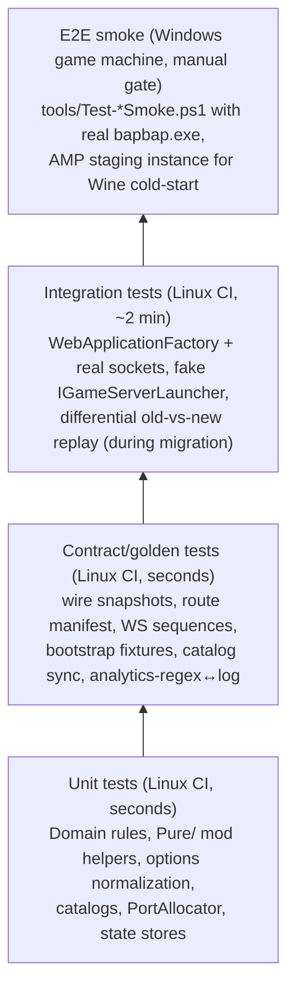

# 05 — Testing and Tooling

## 1. Test pyramid (what runs where)



### 1.1 Unit
- Domain: `LobbyStateMachine` transitions (incl. the two historical races: double
  `START_CUSTOM_GAME` claim, stuck `Starting` after failure — pinned as impossible-state tests),
  leader rules per error code, queue timer math.
- Infrastructure: `BootstrapDriver` state machine against scripted status sequences (success,
  listener-only F033, replay, stall, crash); `JsonFileStore` atomic-rename + concurrency;
  `PortAllocator` cooldown (exists: `PortAndShopTests`, `UdpPortDetectionTests`).
- Mod `Pure/`: bootstrap HTTP request parsing, payload application decisions, INI round-trip,
  identity generation determinism, MATCH-FOUND dedup, carrier-table indexing (extends
  `MelonMapHelpersTests` etc. — these already run on Linux).
- Options: every CSV/JSON dual-form merge (`AvailableCharactersCsv`, `DimensionDataJson`,
  `MapMappingJson`, `PerModeSettingsJson`, prices, placement tables) — moved out of `Program.cs`
  so they finally become directly testable; plus `IValidateOptions` rejection messages.

### 1.2 Contract/golden (the rewrite's safety net — detailed in `03-protocol-compatibility.md`)
- Wire snapshots of every outbound DTO with `JsonContract.Options` vs `.golden.json` files.
- Route manifest: `EndpointDataSource` dump vs `routes.contract.json` — route+method pairs
  (≈158 today: ~122 top-level `app.Map*` + `MapSocketDiscovery` 6×2 + `MapClientJson` 12×2,
  incl. the 16 load aliases, the 6 socket-discovery paths, and the `MapMetagameBootstrapEndpoints`
  family; the dump is authoritative, never a hand-count). The same test asserts route+method
  **uniqueness** — a duplicate registration doesn't fail at startup, it becomes an
  ambiguous-match 500 at request time (see `Program.cs:1271`).
- WS sequence scripts for the connect-time greeting (`SOCKET_READY` → `GAME_MODES_UPDATED` →
  friends state — `03` §1.3), the lobby happy path, every error code, the normalization table,
  the 3-step admin handshake, the banned-at-connect close, and `GAME_STARTED`
  multicast-to-all-connections semantics.
- Bootstrap fixtures shared by server tests and mod `Pure/` tests (full 8-field
  `ManagedBootstrapStatus` shapes — `03` §1.5).
- Stub permissiveness: each HC4 stub returns its frozen 2xx body for empty/garbage/valid input.
- Forbidden-skin test: no code path (shop slots, owned assets, default loadouts, catalog defaults)
  can emit AssetIds 300001/300004/300006.
- Analytics coupling test: **extend the existing `AnalyticsRegexTests.cs`** (it already pins the
  default `AnalyticsOptions` regexes against literal copies of the log lines). The gap to close:
  the test's expected lines are hand-copied strings, so rewording the actual log call site drifts
  silently. Introduce `AnalyticsLogMessages` constants used BOTH at the `LobbyService` log call
  sites and in the test, so `Client {AccountId} connected. admin=…` can't be reworded without a
  red test.

### 1.3 The catalog-sync invariant test (HC5), concretely

One test class, `CatalogSyncTests`, asserting from three real sources in the repo:

```csharp
[Fact]
public void ServerMapCatalog_Matches_MelonCarrierTable()
{
    var carrier = MelonMapHelpers.BuildKnownLevelNames();          // mod project ref (Pure/)
    Assert.Equal(MelonMapHelpers.LevelNameCount, 41);              // size is load-bearing (B25)
    Assert.Equal("Map3_Lyceum", carrier[MapCatalog.LyceumId]);
    Assert.Equal("Arena_Map2", carrier[MapCatalog.ArenaMap2Id]);
    Assert.Equal("OpenBetaMap#J02_P_Boccato", carrier[MapCatalog.OpenBetaBoccatoId]);
    for (int id = MapCatalog.FirstCustomMapId; id <= MapCatalog.MaxCustomMapId; id++)
        Assert.Equal("Arena_Map2", carrier[id]);                   // custom slots use the carrier
    Assert.Equal(40, MapCatalog.MaxCustomMapId);                   // ceiling == carrier length - 1
}

[Fact]
public void AmpConfigJson_CharacterToggles_MatchCharacterCatalog()
{
    // parse deployment/amp-github-autoinstall/bapcustomservergithubconfig.json as a repo file
    var toggles = AmpConfigParser.ReadCharacterToggles(RepoFile("bapcustomservergithubconfig.json"));
    foreach (var t in toggles)                                      // "Allow Anna (charId 1) …"
        Assert.Equal(CharacterCatalog.NameToId[t.Name], t.CharId);
    Assert.Equal(CharacterCatalog.Names.Length, toggles.Count + CustomCharacterCount);
    Assert.True(CharacterCatalog.MedusaCharId >= 15);               // custom chars are id >= 15
}
```

The test project references the Melon project's `Pure/` sources (link-compile the files if the x86
target can't be referenced directly from net10 tests — the existing `MelonMapHelpersTests` already
solve this) and reads the AMP JSON straight from `deployment/`. When Phase 7 introduces catalog
*generation* from `Bap.Catalog/*.json`, this test remains as the backstop that generated outputs
were committed.

### 1.4 Integration
- `WebApplicationFactory` end-to-end flows with `LaunchGameServers=false` + fake
  `IGameServerLauncher`: join → settings → start → `QUEUE_MATCHED`/`GAME_STARTED` over a real WS
  client; queue join → timer fire → same tail. (Seeds: `EndpointIntegrationTests`,
  `MatchLifecycleTests`, `ProxyIntegrationTests`, `LocalReverseProxyIntegrationTests`.)
- **Isolation fix (do this in Phase 0) — with the correct diagnosis:** 2 of 375 tests fail
  (`CharacterPurchase_DebitsTokensAndLoadShowsUnlockAsset` — `Expected: 1, Actual: 3`;
  `CharacterListing_ShowsConfiguredPriceForLockedCharacter` — `Expected: 0, Actual: 1`; both
  reproduced on this VM). This is NOT general `data/` leakage: `EndpointIntegrationTests.AppFactory`
  (`EndpointIntegrationTests.cs:27–64`) already redirects Economy/Friends/Ranked/MatchHistory/
  Admin/PlayerStorage state into a per-run temp dir. The actual hole:
  `CustomServer:PlayerOverrides:StateFile` (default `data/player-overrides.json` resolved against
  `AppContext.BaseDirectory` — `PlayerOverrides.cs:11, 113–117`) is not redirected, and
  `PlayerOverridesService` auto-writes a default document with `unlockEverything: true`
  (`PlayerOverrides.cs:198–216, 253–274`), which `CharacterUnlockService.IsCharacterOwned` honors
  (`CharacterUnlockService.cs:84`) — so the deliberately-locked test character reports as owned
  despite `UnlockAllCharacters=false`. **The fix must OVERRIDE the defaults** (config-seed a
  locked-down overrides document, or add a test knob) — merely relocating the file changes
  nothing because the service regenerates the unlock-everything default at any path.
  `ShopService` (`data/shop-state.json`) is likewise unredirected; redirect it in the same PR.
- Differential replay harness (migration only): tee HTTP to old+new, replay recorded WS sessions,
  diff normalized outputs.

### 1.5 E2E smoke (Windows only — keep, do not port)
The PowerShell scripts stay authoritative for anything involving `bapbap.exe`:
`Test-CustomServerSmoke.ps1`, `Test-LobbySettingsSmoke.ps1`, `Test-AdminControlsSmoke.ps1`,
`Test-MatchStartSmoke.ps1`, `Test-MatchStartTwoClientSmoke.ps1`, `Force-StartMatch.ps1`.
Additions: a `-BaselineServer`/`-CandidateServer` pair of flags on the first three scripts so one
smoke run can compare old vs new during migration phases; plus one AMP-staging Wine cold-start
check per High-risk phase (per `docs/AMP_LINUX_WINE_ROOT_CAUSE.md` runbook).

## 2. Lint / formatting / analyzers

- **`.editorconfig`** at repo root: 4-space C#, file-scoped namespaces, `var` policy, naming rules
  (`_camelCase` fields — matches existing style), `dotnet_analyzer_diagnostic.severity` mappings.
- **`Directory.Build.props`** for all new `Bap.*` projects:
  `<Nullable>enable</Nullable>`, `<TreatWarningsAsErrors>true</TreatWarningsAsErrors>`,
  `<AnalysisLevel>latest-recommended</AnalysisLevel>`, `<EnforceCodeStyleInBuild>true</EnforceCodeStyleInBuild>`.
  Legacy `CustomMatchServer`/`BapCustomServerMelon` get `<TreatWarningsAsErrors>` only for a curated
  ID list at first (they won't be clean day one), ratcheting up per migration phase; the Melon
  project additionally keeps net6.0/x86 and must NOT get nullable flipped wholesale (Unity/Il2Cpp
  interop produces unavoidable null-suppression noise — enable per-file with `#nullable enable` as
  files move into components).
- **`dotnet format`** verification in CI (`--verify-no-changes`) for the new projects.
- **Architecture test** (NetArchTest or equivalent): `Bap.Protocol`/`Bap.Catalog` reference nothing;
  `Bap.Domain` references only Protocol/Catalog; `Bap.Application` never references
  `Bap.Infrastructure` or ASP.NET; endpoints classes contain no business logic types (heuristic:
  no direct `IStateStore` usage).
- **Banned-API test**: no `DateTime.UtcNow` outside `IClock` implementations in new code (the admin
  grant cache and cooldown logic are time-sensitive); no `Task.Result`/`.Wait()`.

## 3. CI outline (GitHub Actions; all Linux except the manual gate)

**Prerequisite: there is NO `.sln` in the repo today** (verified — six `.csproj`s, no solution
file). Creating `BapCustomServer.sln` (server + proxy + tests + new `Bap.*` projects; the two
Melon csprojs kept OUT of it so `dotnet build` of the solution never needs Unity reference DLLs)
is itself a Phase 0 deliverable, not an existing asset.

```yaml
# .github/workflows/ci.yml (outline)
on: [push, pull_request]
jobs:
  build-test:
    runs-on: ubuntu-latest
    steps:
      - uses: actions/checkout@v4            # do NOT need lfs: true for this job
      # GOTCHA (verified): ~2,580 stale build outputs under bin//obj/ are TRACKED in git
      # (committed before the **/bin//**/obj/ ignore rules), and .gitattributes:5 routes *.dll
      # through Git LFS. Depending on LFS availability they check out as ~130-byte pointer
      # files or as stale assemblies; either way `dotnet test` can pick them up and report
      # "No test is available", and incremental builds don't always overwrite them. Delete
      # them before building (and untrack them for good in Phase 7 — see 04 Phase 7 / Q7):
      - run: git ls-files -z '*/bin/*' '*/obj/*' | xargs -0 -r rm -f
      - uses: actions/setup-dotnet@v4        # net10 SDK (repo dotnet --version is 10.x)
      - run: dotnet format --verify-no-changes ./src   # new projects only
      - run: dotnet build BapCustomServer.sln -c Release -warnaserror   # sln created in Phase 0
      - run: dotnet test tests/ -c Release --collect:"XPlat Code Coverage"
        # includes: existing 375 tests, Protocol goldens, ContractTests,
        # CatalogSyncTests, architecture tests, mod Pure/ tests
  linux-publish-smoke:                       # cheap HC2 signal on every PR
    runs-on: ubuntu-latest
    steps:
      - uses: actions/checkout@v4
      - run: git ls-files -z '*/bin/*' '*/obj/*' | xargs -0 -r rm -f
      - uses: actions/setup-dotnet@v4
      - run: dotnet publish CustomMatchServer/BapCustomServer.csproj -c Release -r linux-x64 --self-contained -o publish
      - run: |                               # boot the published binary, hit /health, kill it
          ./publish/BapCustomServer & sleep 5
          curl -fsS http://127.0.0.1:5055/health
      - run: shellcheck deployment/amp-full-linux-wine/start-match.sh
  melon-mod-build:
    runs-on: ubuntu-latest                   # build-only; execution needs Windows+game
    steps:
      - uses: actions/checkout@v4
      # The 7 UnityEngine reference DLLs the mod needs live under
      # AssetRip/AuxiliaryFiles/GameAssemblies/ — tracked as Git LFS objects (114 DLLs, ~17 MB
      # total). The folder is gitignored (.gitignore:8, legacy-tracked files), and a plain
      # checkout materializes them as ~130-byte LFS pointers → CS0246. Fetch just that slice
      # and cache it (verified working on this repo):
      - run: git lfs pull --include="AssetRip/AuxiliaryFiles/GameAssemblies/*"
        # cache key: hash of `git ls-files -s AssetRip/AuxiliaryFiles/GameAssemblies`
      - run: dotnet build BapCustomServerMelon/BapCustomServerMelon.csproj -c Release
  differential:                              # migration phases only
    runs-on: ubuntu-latest
    steps:
      - run: dotnet run --project tools/DiffHarness -- --http --ws-replay fixtures/sessions/
  package:
    needs: [build-test, melon-mod-build]
    if: startsWith(github.ref, 'refs/tags/')
    steps:
      - run: ./tools/build-amp-package.sh    # bash port of Build-AmpGitHubAutoInstallPackage.ps1
                                             # (or run PowerShell via pwsh on the runner)
```

Notes:
- **Mod-build supply chain (decision recorded):** `AssetRip/AuxiliaryFiles/GameAssemblies/` is
  NOT a plainly available folder. Ground truth (verified on this workspace): the 114 `*.dll`
  files are legacy-tracked Git LFS objects inside a gitignored folder (`.gitignore:8`;
  `ARTIFACT_MANIFEST.md:11` describes the full 2.27 GB `AssetRip/` export as local-only — only
  this DLL slice is committed). A fresh clone WITHOUT `git lfs pull` gets pointer files and the
  mod build fails (CS0246, reproduced); after `git lfs pull --include=…GameAssemblies/*` it
  builds (reproduced). So `melon-mod-build` works **if and only if** the LFS fetch step is
  present and LFS bandwidth/quota holds. Preferred hardening: publish ONLY the 7 UnityEngine
  reference DLLs the csproj actually references as a secured release asset / private artifact,
  restore+cache that in CI, and stop depending on the gitignored folder. Either way, note the
  licensing caveat: these are Unity-engine redistributables extracted from the game install —
  keep them in a private artifact store, never a public package feed. If neither mechanism is
  acceptable, DROP this CI job and gate mod compilation on the Windows machine (making the
  Phase 6 per-step "mod builds" exit criterion a Windows-side check).
- The Windows smoke gate is a **manually-triggered checklist**, not CI: run the `tools/Test-*` set
  on the game machine, paste results into the phase-exit PR. `Test-MatchStart*` cannot run headless
  in CI because they spawn real game processes and wait up to ~180 s for bootstrap.
- `linux-publish-smoke` is a cheap standing HC2 check (publish shape + boot + `/health` + a
  `shellcheck` pass over the Wine launch wrapper); the real Wine cold-start still needs the AMP
  staging instance per High-risk phase.
- Coverage is informational for legacy code, enforced (e.g. ≥80% line) for `Bap.Domain` and
  `Bap.Protocol` where coverage is cheap and meaningful.

## 4. Developer tooling

- `tools/generate-catalogs` (Phase 7): reads `Bap.Catalog/*.json`, regenerates the server catalog
  accessors, the Melon carrier-table constants, and the AMP config JSON blocks; CI check verifies
  committed outputs match (like `dotnet format --verify-no-changes` but for catalogs).
- `tools/DiffHarness`: the old-vs-new differential proxy/replayer (retired to on-demand after
  Phase 7).
- WS session recorder: opt-in server flag that appends `{direction, event, payload}` NDJSON per
  connection — produces replay fixtures from real Windows sessions for the differential harness.
- Keep `tools/*.ps1` as-is; new cross-platform tooling is bash or `dotnet run`-based so the Linux
  CI and the AMP host can execute it (this workspace has no `pwsh`).
